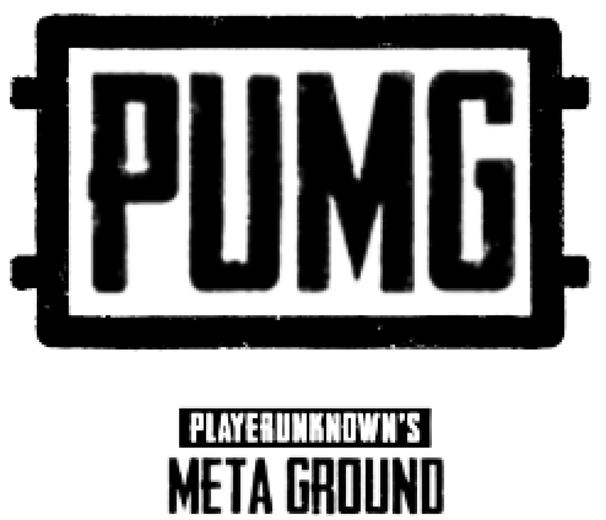
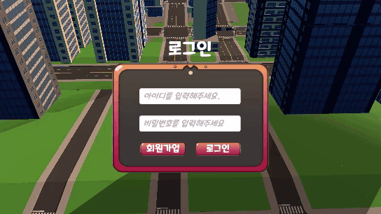
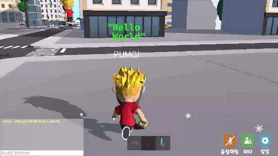
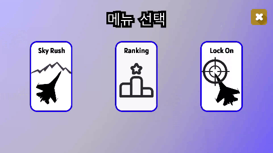

# :desktop_computer: PUMG - PLAYER UNKNOWN META GROUND



</br>

## :zap: 다운로드 링크 : [PUMG](http://bitly.ws/EKBB)

---

</br>

## :movie_camera: 소개 영상 : [UCC 링크](https://www.youtube.com/watch?v=e5TBcm8Tz0A)

---

</br>

## ✔ 프로젝트 진행 기간

---

2023.04.10 ~ 2023.05.26(총7주)

</br>

## ✔ 개요

---

PUMG(PLAYER UNKNOWN META GROUND)는 온라인 공간에서 진행되는 Unity 엔진 기반의 메타버스 플랫폼입니다. PUMG의 주요 목표는 플레이어들이 **가상 공간**에서 서로 만나고 상호작용하며 **다양한 미니게임**을 통해 즐거움을 얻는 것 입니다. 플레이어들은 서로 만나고, 함께 게임을 하고, 휴식을 취하는 경험을 통해 디지털 환경에서의 새로운 형태의 사회적 연결성을 체험할 수 있습니다.

</br>

## ✔ 주요 기능

---

- ### 메인 월드

  - 메인 월드에서 활동할 캐릭터를 선택할 수 있습니다.
  - H 키를 통해 조작키를 확인할 수 있습니다.
  - M 키를 통해 미니맵을 확인할 수 있습니다.
  - E 키를 통해 획득한 칭호를 확인하고 선택하여 착용할 수 있습니다. 
  - 옵션을 통해 화면 모드, 해상도, 스피커 및 마이크를 설정할 수 있습니다.
  - 파티 기능을 통해 다른 플레이어와 파티를 맺을 수 있습니다.
  - 음성 채팅 기능을 통해 다른 플레이어와 소통 할 수 있습니다.
  - 1, 2, 3 번 키를 통해 무기 변경 및 장착이 가능하며 마우스 우클릭으로 사용이 가능합니다.

- ### 방탈출 게임

  - H 키를 통해 조작키를 확인할 수 있습니다.
  - I 키를 통해 인벤토리를 on/off 할 수 있습니다.
  - C 키를 통해 손전등을 on/off 할 수 있습니다.
  - Z 키를 통해 조준선을 on/off 할 수 있습니다.
  - E 키를 통해 아이템을 획득할 수 있습니다.
  - F 키를 통해 물체와 상호작용 할 수 있습니다.
 
- ### 힐링 섬

  - 힐링섬에서 활동할 캐릭터를 선택할 수 있습니다.
  - 바다에서 수영이 가능합니다.
  - Space 키를 통해 수영 중 물 위로 올라올 수 있습니다.
  - H 키를 통해 조작키를 확인할 수 있습니다.
  - M 키를 통해 지도를 on/off 할 수 있습니다.
  - F 키를 통해 휴식하기, 불 끄고 켜기 등 다양한 상호작용을 시도할 수 있습니다.

- ### 전투기 시뮬레이션

  - 초기 메뉴에서 Sky Rush, Lock On, Lanking 중 하나를 선택하여 진행할 수 있습니다.
  - H 키를 통해 조작키를 확인할 수 있습니다.
  - Q, E, 방향키를 통해 전투기를 이동하고 Space 키를 통해 감속이 가능합니다.
  - R 키를 통해 장소 리스폰이 가능합니다.
  - F 키를 통해 미사일 장전 및 발사가 가능합니다.
  - Lanking 메뉴에서 자신의 랭킹을 확인할 수 있습니다. 

</br>

## ✔ 주요 기술

---


**Server**

- IntelliJ IDE 2021.2.4
- OpenJDK 11
- Springboot 2.7.11
- Spring Framework 5.3.24
- Spring Data JPA
- Spring Gradle 7.6
- MySQL 8.0.33
- Photon PUN 2.41
- Vivox 15.1.200000-pre.1

**Client**
- Unity 2021.3.22f1

**CI/CD**
- AWS EC2
- Ubuntu 20.04 LTS
- Docker 20.10.12
- Jenkins 2.375.1

**Modeling**
- Blender 5.0

</br>

## ✔ 프로젝트 디렉토리 기본구조

---

### Server

```
server
  ├── config
  ├── controller
  ├── dto
  ├── entity
  ├── exception
  ├── repository
  └── service
```

</br>

### Client

```
client
  ├── RoomEscape
  │   ├── Animation
  │   ├── Images
  │   ├── Locks
  │   ├── Items
  │   └── Scripts
  ├── HealingSection
  │   ├── Animation
  │   ├── Animator
  │   ├── PostProcessing
  │   ├── Prefabs
  │   ├── Texture
  │   ├── Scripts
  │   └── BGM
  ├── Aircraft_Simulator
  │   ├── IMG
  │   ├── Model
  │   ├── Prefab
  │   ├── Sound
  │   ├── Terrain
  │   ├── Texture
  │   └── Script
  ├── LoadScene
  │   ├── Escape
  │   └── Scene
  ├── Padlock Pack
  │   └── Padlocks
  ├── Photon
  │   ├── PhotonChat
  │   ├── PhotonLibs
  │   ├── PhotonRealtime
  │   ├── PhotonUnityNetworking
  │   └── PhotonVoice
  └── Scenes
      ├── 04 - City
      ├── 04 - City_Profiles
      ├── HealingScene
      └── HealingScene_Profiles
```

</br>

## ✔ CI/CD

---

### Docker 컨테이너로 나누어 관리, 젠킨스를 통해 자동 빌드, 배포 중
</br>

## ✔ 협업 툴

---

- Plastic SCM
- GitLab
- Notion
- JIRA
- MatterMost
- Webex

</br>

## ✔ 팀원 역할 분배

---

- **간호성(팀장)** : 방탈출 담당, 시네마틱 및 캐릭터 애니메이션, 음성 채팅 기능, UCC 촬영 및 편집 등

- **김동준** : 전투기 시뮬레이션 담당, API 서버 구축, 칭호 기능, 전투기 조종 및 미사일 기능 등

- **김태수** : 힐링섬 담당, 발표자, 애니메이션 디자인, 렌더링 처리, 오브젝트 상호작용 등

- **김성훈** : 힐링섬 담당, PPT 편집, 애니메이션 디자인, 렌더링 처리, 오브젝트 상호작용 등

- **김주성** : 방탈출 담당, 아이템 디자인, 아이템 및 오브젝트 상호작용 등

- **정도형** : 메인 월드 담당, 오브젝트 애니메이션 및 상호작용, 음성 및 텍스트 채팅 기능, 동기화 서버 구축 등

</br>

## ✔ 프로젝트 산출물

---

- [회의록](https://sugared-open-363.notion.site/3c5f774e6b0d4be7ad35f89ea58adff5)
- [시스템 구조도](https://sugared-open-363.notion.site/eeef3f2dfa9543fb9fd846a864a237f9)
- [API 명세서](https://sugared-open-363.notion.site/API-d5c308f313824a7388bd2763fbaca055)
- [요구사항 명세서](https://sugared-open-363.notion.site/03de675774d54b7bb2ead1fa2fd008d2)
- [UI/UX](https://www.figma.com/file/Nfk5lCZnYVZfhQfOL6jWvK/World?type=design&node-id=0-1&t=1yk2Xoj57pYaSSAC-0)
- [ERD](https://sugared-open-363.notion.site/ER-Diagram-0d29a576cd624150bceabba58628641c)
- [에러 모음집](https://sugared-open-363.notion.site/43151088ae3641af8839839b09cc9058)

</br>

## :globe_with_meridians: PUMG 서비스 화면

### 로그인

* 로그인 화면입니다.

### 메인 월드 - 입장

- 메인 월드 입장 후 화면입니다.

### 메인 월드 - 단축키 설명

- 단축키 설명 화면입니다.

### 메인 월드 - 칭호 확인

- 칭호 확인 화면입니다.

### 메인 월드 - 상호작용

- 상호작용 화면입니다.
- 무기 장착 후 다른 플레이어와 상호작용이 가능합니다.

### 메인 월드 - 파티

- 파티 신청 및 수락 화면입니다.

### 메인 월드 - 포탈

- 포탈 화면입니다.

### 방탈출 - 인벤토리 및 아이템 획득

- 인벤토리 화면입니다.
- E 키를 사용해서 아이템 획득이 가능합니다.
- 아이템에 커서를 올리면 아이템의 상세정보를 확인할 수 있습니다.

### 방탈출 - 단서 상호작용

- F 키를 사용해서 단서와 상호작용이 가능합니다.

### 방탈출 - 자물쇠 상호작용

- F 키를 사용해서 자물쇠와 상호작용이 가능합니다.
- A, W, S, D, 마우스를 사용해서 조작이 가능합니다.

### 힐링섬 - 섬 물체 상호작용

- F 키를 사용해서 물체와 상호작용이 가능합니다.
- 선베드에 눕기, 불 끄고 켜기 등이 가능합니다.

### 힐링섬 - 수영 및 낚시

- 바다에서 수영 및 낚시가 가능합니다.

### 힐링섬 - 낮밤 변경

- 낮과 밤이 시간에 따라 변화합니다.

### 전투기 시뮬레이션 - 비행기 조종

- Q, W, 방향키를 사용해서 비행기 조종이 가능합니다.
- F 키를 사용해서 미사일 발사가 가능합니다.

### 전투기 시뮬레이션 - 타깃 맞추기

- 전투기 조종 중 미사일로 타깃을 맞출 수 있습니다.

### 전투기 시뮬레이션 - 랭킹 확인

- 랭킹 보드를 통해 랭킹을 확인할 수 있습니다.

---
