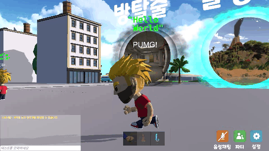
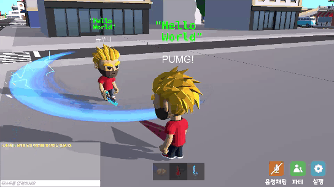

# 시연 시나리오

### 로그인

* 로그인을 진행합니다.

### 메인 월드 - 입장

- 메인 월드에 입장합니다.

### 메인 월드 - 단축키 설명

- 단축키 설명 화면입니다.

### 메인 월드 - 칭호 확인

- 칭호 확인 화면입니다.

### 메인 월드 - 상호작용

- 상호작용 화면입니다.
- 무기 장착 후 다른 플레이어와 상호작용이 가능합니다.

### 메인 월드 - 파티

- 파티 신청 및 수락 화면입니다.

### 메인 월드 - 포탈

- 포탈 화면입니다.

### 전투기 시뮬레이션 - 비행기 조종

- Q, W, 방향키를 사용해서 비행기 조종이 가능합니다.
- F 키를 사용해서 미사일 발사가 가능합니다.

### 전투기 시뮬레이션 - 타깃 맞추기

- 전투기 조종 중 미사일로 타깃을 맞출 수 있습니다.

### 전투기 시뮬레이션 - 랭킹 확인

- 랭킹 보드를 통해 랭킹을 확인할 수 있습니다.

### 힐링섬 - 섬 물체 상호작용

- F 키를 사용해서 물체와 상호작용이 가능합니다.
- 선베드에 눕기, 불 끄고 켜기 등이 가능합니다.

### 힐링섬 - 수영 및 낚시

- 바다에서 수영 및 낚시가 가능합니다.

### 힐링섬 - 낮밤 변경

- 낮과 밤이 시간에 따라 변화합니다.

### 방탈출 - 인벤토리 및 아이템 획득

- 인벤토리 화면입니다.
- E 키를 사용해서 아이템 획득이 가능합니다.
- 아이템에 커서를 올리면 아이템의 상세정보를 확인할 수 있습니다.

### 방탈출 - 단서 상호작용

- F 키를 사용해서 단서와 상호작용이 가능합니다.

### 방탈출 - 자물쇠 상호작용

- F 키를 사용해서 자물쇠와 상호작용이 가능합니다.
- A, W, S, D, 마우스를 사용해서 조작이 가능합니다.

---
